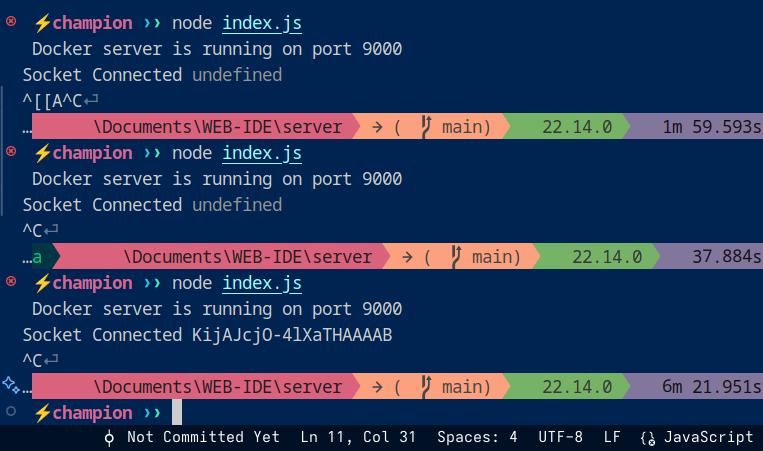

# 🚀 Node-PTY Troubleshooting Guide  

> **Task of the Day:** *Solved my 3rd Node.js PTY error!* ✅  

---

## 📸 Screenshots  

### (a) Terminal Error Encountered  
  
*`EACCES` error when installing `node-gyp`*  

### (b) Node-PTY Multi-Arch Solution  
  
*Switched to `node-pty-prebuilt-multiarch` for cross-platform support*  

### (c) Meme: The Struggle is Real 😅  
  

### (d) Socket.io is availabe only on application form  
  
*Switched to `postman--Desktop-app` and termainal:data in events should be asked*  
---

## 🔧 Problem & Fix  

### **Error:**  
- `EACCES: Permission denied` when running `npm install -g node-gyp`  
- `node-pty` failed to build on Fedora 42  

### **Solution:**  
✅ **Used `node-pty-prebuilt-multiarch`** – A maintained fork with prebuilt binaries!  
✅ **Fixed permissions** – Used `sudo` (carefully!) or `npm config set prefix ~/.npm-global`  
✅ **Installed dependencies:**  
   ```bash
   sudo dnf install -y make gcc g++ python3 libsecret-devel libX11-devel
